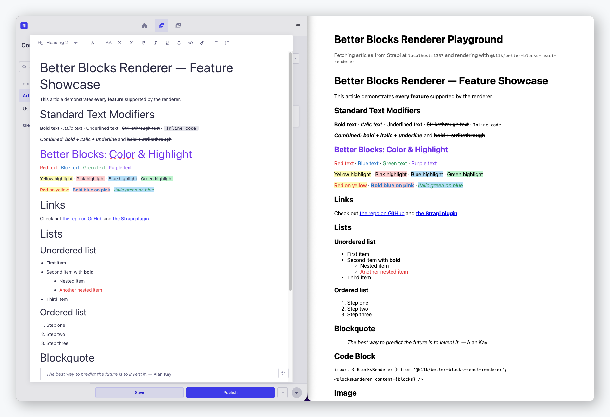

<h1 align="center">Better Blocks Astro Renderer</h1>

<p align="center">Native Astro renderer for Strapi v5 Blocks content — supports all standard blocks plus Better Blocks features: color, highlight, text alignment, nested lists, to-do lists, tables, media embeds, image captions, and more. Zero client-side JavaScript.</p>

<p align="center">
  <a href="https://www.npmjs.com/package/@k11k/better-blocks-astro-renderer">
    
  </a>
  <a href="https://www.npmjs.com/package/@k11k/better-blocks-astro-renderer">
    
  </a>
  <a href="https://github.com/k11k-labs/better-blocks-astro-renderer/blob/main/LICENSE">
    
  </a>
  <a href="https://buymeacoffee.com/k11k">
    
  </a>
</p>

<p align="center">
  
</p>

---

## Table of Contents

1. [Why?](#why)
2. [Compatibility](#compatibility)
3. [Installation](#installation)
4. [Usage](#usage)
5. [Supported Blocks](#supported-blocks)
6. [Supported Modifiers](#supported-modifiers)
7. [Custom Renderers](#custom-renderers)
8. [TypeScript](#typescript)
9. [Contributing](#contributing)
10. [Support this project](#support-this-project)
11. [License](#license)

---

## Why?

The official Strapi blocks renderers are built for React. If your site is built with [Astro](https://astro.build/), you _can_ render Strapi blocks through the [`@astrojs/react`](https://docs.astro.build/en/guides/integrations-guide/react/) integration — but that pulls React into your build for what is purely presentational content.

This package is a **native Astro renderer**. It renders Strapi v5 Blocks content — including every feature the [Better Blocks](https://github.com/k11k-labs/strapi-plugin-better-blocks) plugin adds (color marks, text alignment, to-do lists, tables, media embeds, and more) — using plain `.astro` components. The output is **static HTML with zero client-side JavaScript**, and math is rendered to a string on the server (see [Math (KaTeX)](#math-katex)).

It is a **drop-in renderer** that handles all Better Blocks features out of the box — no configuration needed.

## Compatibility

| Strapi Version | Renderer Version | Astro Version |
| -------------- | ---------------- | ------------- |
| v5.x           | v0.x             | &ge; 4        |

## Installation

```bash
# Using yarn
yarn add @k11k/better-blocks-astro-renderer

# Using npm
npm install @k11k/better-blocks-astro-renderer
```

**Peer dependencies:** `astro >= 4`

## Usage

```astro
---
import { BlocksRenderer } from '@k11k/better-blocks-astro-renderer';

const { blocks } = Astro.props;
---

<BlocksRenderer content={blocks} />
```

That's it. All Better Blocks features — colors, tables, to-do lists, media embeds, alignment, and more — work automatically, and the component renders to static HTML (no hydration, no client directive).

A typical page that fetches from Strapi:

```astro
---
import { BlocksRenderer, type BlocksContent } from '@k11k/better-blocks-astro-renderer';
// Import the KaTeX stylesheet once (e.g. in a shared layout) so math displays correctly.
import 'katex/dist/katex.min.css';

const res = await fetch('https://your-strapi.example.com/api/articles?status=published');
const { data } = await res.json();
---

{
  data.map((article: { content: BlocksContent }) => (
    <article>
      <BlocksRenderer content={article.content} />
    </article>
  ))
}
```

### Math (KaTeX)

Math nodes are rendered with [KaTeX](https://katex.org/) — inline math becomes a `<span class="katex-inline">` and block math a `<div class="katex-block">`. Rendering happens via `katex.renderToString` on the server, so it works during SSR and static builds with **no client-side hydration step**.

KaTeX needs its stylesheet to display correctly. Import it **once** in your app (for example in a shared layout):

```astro
---
import 'katex/dist/katex.min.css';
---
```

`katex` ships as a dependency of this package, so the stylesheet resolves without a separate install. If KaTeX fails to parse a formula, the renderer falls back to the raw LaTeX source instead of crashing.

### Diagrams (Mermaid)

[Mermaid](https://mermaid.js.org/) diagram blocks (`{ type: 'diagram', format: 'mermaid' }`) are **pre-rendered to inline SVG on the server** using [`beautiful-mermaid`](https://www.npmjs.com/package/beautiful-mermaid) — a pure-Node renderer that needs **no headless browser** (no Puppeteer, no Chromium download). Like math, rendering happens during SSR and static builds with **zero client-side JavaScript** and no hydration step.

Supported diagram types — **flowchart, sequence, state, class, ER, and xychart** — render to a `<div class="mermaid-diagram">` wrapping the generated SVG. Diagram types `beautiful-mermaid` does not implement yet (gantt, pie, mindmap, gitGraph, …) and any source that fails to parse fall back gracefully to the raw definition in a `<pre class="mermaid-source">`, so content is never lost.

`beautiful-mermaid` ships as a dependency of this package, so no extra install or stylesheet is required.

#### Diagram colors

Diagrams render **in color** by default, with a palette that mirrors mermaid.js's familiar look (lavender node fills, purple borders, dark edges). Pass `diagramTheme` to pick a built-in palette (`github-light`, `github-dark`, `dracula`, `nord`, `tokyo-night`, `catppuccin-mocha`, `solarized-light`, …) or a custom color object (`{ bg, fg, line, accent, muted, surface, border }`):

```astro
---
import { BlocksRenderer } from '@k11k/better-blocks-astro-renderer';
const { blocks } = Astro.props;
---

<!-- built-in theme -->
<BlocksRenderer content={blocks} diagramTheme="github-dark" />

<!-- or a custom palette -->
<BlocksRenderer content={blocks} diagramTheme={{ bg: '#fff', fg: '#1f2328', accent: '#8250df' }} />
```

> `beautiful-mermaid` derives a clean, single-accent palette from these colors — it is intentionally minimal, not a 1:1 clone of mermaid.js's multi-color default theme. To take full control of the markup (e.g. to render with the real mermaid.js on the client), override the `diagram` block via `blocks.diagram`.

### Callouts (Admonitions)

Block-level `callout` nodes render GitHub-style alerts in five variants &mdash; `note`, `tip`, `important`, `warning`, and `caution`. Each renders as an `<aside role="note">` with a colored left border, a title row (icon + label), and the nested block children (paragraphs, lists, links, etc.). If a `title` is set on the node it is used; otherwise the localized variant label is shown.

Colors come from a small **scoped `<style>`** that ships with the component (still zero client-side JavaScript), and the default palette **adapts to dark mode automatically** via `@media (prefers-color-scheme: dark)`. The accent for each variant is driven by a `--bb-callout-accent` custom property on the `.bb-callout-{variant}` element, so you can retheme colors from your own CSS without replacing the markup:

```css
/* Recolor a single variant, or override per color scheme */
.bb-callout-note {
  --bb-callout-accent: #2563eb;
}
```

To replace the markup entirely, override the `callout` block. It receives `variant` and `title`; the nested children arrive via `<slot />`:

```astro
---
import { BlocksRenderer } from '@k11k/better-blocks-astro-renderer';
import MyCallout from '../components/MyCallout.astro';
const { blocks } = Astro.props;
---

<BlocksRenderer content={blocks} blocks={{ callout: MyCallout }} />
```

### Details / Summary (Collapsible)

Block-level `details` nodes render a native, keyboard-accessible `<details>` / `<summary>` disclosure with **zero client-side JavaScript** &mdash; the open/closed state is handled entirely by the browser. The `summary` field is the plain-text label, the optional `defaultOpen` boolean maps to the HTML `open` attribute (honored on initial render so screen readers get the correct state), and `children` are block-level content (paragraphs, lists, tables, images, and nested `details`) rendered after the summary. The default markup carries stable `bb-details` and `bb-details-summary` classes.

A small **scoped `<style>`** ships with the component (still zero client-side JavaScript): a GitHub-inspired card with a rotating disclosure marker. Retheme it from your own CSS via the `--bb-details-*` custom properties (`--bb-details-border`, `--bb-details-bg`, `--bb-details-summary-bg`, `--bb-details-marker`) without replacing the markup:

```css
.bb-details {
  --bb-details-border: #c8c8c8;
  --bb-details-summary-bg: #eee;
}
```

To replace the markup entirely, override the `details` block. It receives `summary` and `defaultOpen`; the nested children arrive via `<slot />`:

```astro
---
import { BlocksRenderer } from '@k11k/better-blocks-astro-renderer';
import MyDetails from '../components/MyDetails.astro';
const { blocks } = Astro.props;
---

<BlocksRenderer content={blocks} blocks={{ details: MyDetails }} />
```

### Buttons (CTA & File Download)

Block-level `button` nodes render a WordPress-style call-to-action as a single, accessible `<a>` (or a styled `<span>` when no target is set). Two modes are driven by `buttonType`:

- **Link** (`buttonType: 'link'`) → `<a href={link.url} target rel aria-label>` for a normal CTA. `rel="noopener noreferrer"` is honored when present (the editor adds it automatically for `target="_blank"`).
- **File** (`buttonType: 'file'`) → a download link (`<a href={file.url} download={file.name}>`) for a Media Library asset, optionally prefixed with a file-type icon (`showFileIcon`) and suffixed with a human-readable size (`showFileSize`, e.g. `(5 MB)`).

#### Download vs. preview

By default a file button **force-downloads** the asset. The native `download` attribute only works same-origin, so for cross-origin assets (Strapi/CDN) browsers ignore it and open renderable files (PDF, video, images) inline. To fix that, download-mode buttons are tagged `data-bb-download` and a **tiny scoped `<script>`** (the renderer's only client-side JavaScript) fetches the asset as a blob and saves it from a same-origin object URL. This is progressive enhancement: without JS the anchor still works via its `href` + `download` attributes, and a CORS-blocked fetch falls back to native navigation.

Set `filePreview: true` to instead **open the file in a new tab** (`target="_blank" rel="noopener noreferrer"`, no download) so users can preview it before saving — this path is fully zero-JS.

The optional `style` object is applied as inline CSS (`backgroundColor`, `textColor`, `borderRadius`, `fontSize`, `fontWeight`, `padding`, `border`), and `alignment` (`left` / `center` / `right`) wraps the button in a `text-align`ed `.bb-button-wrapper` (`none` renders it inline with no wrapper). A `cssClass` is appended to the default `bb-button` class for theming.

Because inline styles can't express `:hover`, the `hoverBackgroundColor` / `hoverTextColor` are exposed as `--bb-button-hover-bg` / `--bb-button-hover-color` custom properties, and a **scoped `<style>`** wires up the hover transition and a visible keyboard focus ring by default — no extra CSS required.

To replace the markup entirely, override the `button` block. It receives `label`, `buttonType`, `alignment`, `link`, `file`, `showFileSize`, `showFileIcon`, `filePreview`, `style`, and `cssClass` as props:

```astro
---
import { BlocksRenderer } from '@k11k/better-blocks-astro-renderer';
import MyButton from '../components/MyButton.astro';
const { blocks } = Astro.props;
---

<BlocksRenderer content={blocks} blocks={{ button: MyButton }} />
```

### Social Embeds

Block-level `social-embed` nodes render a post from Twitter/X, Instagram, Facebook, TikTok, LinkedIn, or Pinterest. The renderer picks the embed HTML in priority order:

1. **`embedCode`** &mdash; a manual override pasted by the author, if present.
2. **`oembed.html`** &mdash; the markup the plugin fetched from the platform's oEmbed API at author time (a `<blockquote>` for Twitter/TikTok/Instagram, an `<iframe>` for Pinterest/LinkedIn).
3. **Fallback link card** &mdash; when neither is available, a plain `<a>` link to the original post, enriched with the oEmbed `thumbnailUrl`, `title`, and `author` when present, so the block always links somewhere useful.

The embed is wrapped in a `<figure class="bb-social-embed bb-social-embed-{platform} social-embed align-{alignment}">` (alignment defaults to `center`) with an `aria-label` describing it (`"{providerName} post by {author}"`), and the optional `caption` renders below it in a `<figcaption>`. Any `<iframe>` in the embed markup (e.g. LinkedIn) is given `loading="lazy"`. This markup is byte-for-byte compatible with the [React renderer](https://github.com/k11k-labs/better-blocks-react-renderer), so shared CSS themes both.

**Widget scripts (lazy & deduped).** Twitter, Instagram, TikTok, Pinterest, and Facebook enhance their `<blockquote>`/`<div>` markup into a rich embed via a platform script (LinkedIn renders a self-contained `<iframe>` and needs none). Because Astro ships zero JavaScript by default, this block adds one tiny loader — its only client-side script — that watches embeds with an **IntersectionObserver** and injects a platform's script **once per page** (deduped by URL, guarded against double-injection) only when one of its embeds nears the viewport, so no third-party JavaScript loads eagerly. After the script loads it re-runs the platform's processor (`twttr.widgets.load()`, `instgrm.Embeds.process()`, `FB.XFBML.parse()`, &hellip;), and it re-scans on `astro:page-load` so view-transition navigations upgrade too.

> **Trust boundary.** The embed HTML is emitted verbatim via Astro's `set:html` and is **not** sanitized &mdash; social embeds rely on `<script>`/`<iframe>`/`<blockquote>` that a sanitizer would strip. This markup originates from the platform's oEmbed API or a manual override entered by a trusted editor, so treat your CMS content as trusted. If you accept `social-embed` blocks from untrusted authors, sanitize on the server before storing.

To fully control the markup, override the `social-embed` block. It receives `platform`, `url`, `embedCode`, `oembed`, `alignment`, and `caption`:

```astro
---
import { BlocksRenderer } from '@k11k/better-blocks-astro-renderer';
import MySocialEmbed from '../components/MySocialEmbed.astro';
const { blocks } = Astro.props;
---

<BlocksRenderer content={blocks} blocks={{ 'social-embed': MySocialEmbed }} />
```

## Supported Blocks

| Block                           | Default element      | Source                      |
| ------------------------------- | -------------------- | --------------------------- |
| `paragraph`                     | `<p>`                | Strapi core                 |
| `heading` (1&ndash;6)           | `<h1>`&ndash;`<h6>`  | Strapi core                 |
| `list` (ordered/unordered/todo) | `<ol>` / `<ul>`      | Strapi core + Better Blocks |
| `list-item`                     | `<li>`               | Strapi core                 |
| `link`                          | `<a>`                | Strapi core                 |
| `quote`                         | `<blockquote>`       | Strapi core                 |
| `code`                          | `<pre><code>`        | Strapi core                 |
| `image`                         | `<figure>`      | Strapi core                 |
| `horizontal-line`               | `<hr>`               | Better Blocks               |
| `table`                         | `<table>`            | Better Blocks               |
| `media-embed`                   | `<iframe>` (16:9)    | Better Blocks               |
| `math` (inline/block)           | `<span>` / `<div>`   | Better Blocks               |
| `diagram` (mermaid)             | `<div>` (inline SVG) | Better Blocks               |
| `callout` (admonition)          | `<aside>`            | Better Blocks               |
| `details` (collapsible)         | `<details>`          | Better Blocks               |
| `button` (CTA / file download)  | `<a>` / `<span>`     | Better Blocks               |
| `social-embed`                  | `<figure>`           | Better Blocks               |

### Block properties

| Property       | Applies to                | Description                                                                                            |
| -------------- | ------------------------- | ------------------------------------------------------------------------------------------------------ |
| `textAlign`    | paragraph, heading, quote | Text alignment (`left`, `center`, `right`, `justify`)                                                  |
| `lineHeight`   | paragraph, heading, quote | CSS line-height value (e.g. `1.5`, `2.0`)                                                              |
| `indent`       | paragraph, heading, quote | Block indentation level (`marginLeft: N * 2rem`)                                                       |
| `indentLevel`  | list                      | Cycling list-style-type per nesting depth                                                              |
| `format`       | list                      | `ordered`, `unordered`, or `todo`                                                                      |
| `checked`      | list-item (in todo lists) | Checkbox state (`true`/`false`)                                                                        |
| `target`       | link                      | `_blank` for new-tab links                                                                             |
| `rel`          | link                      | `noopener noreferrer` for new-tab links                                                                |
| `caption`      | image                     | Text displayed below the image                                                                         |
| `imageAlign`   | image                     | Image alignment (`left`, `center`, `right`)                                                            |
| `url`          | media-embed               | Embed URL (YouTube/Vimeo iframe src)                                                                   |
| `originalUrl`  | media-embed               | Original user-provided URL                                                                             |
| `format`       | math                      | `inline` (`<span>`) or `block` (`<div>`)                                                               |
| `value`        | math                      | LaTeX source rendered with KaTeX                                                                       |
| `format`       | diagram                   | `mermaid` (the only supported diagram format)                                                          |
| `value`        | diagram                   | Mermaid source, pre-rendered to SVG on the server                                                      |
| `summary`      | details                   | Plain-text label for the `<summary>`                                                                   |
| `defaultOpen`  | details                   | Open on initial render (HTML `open` attribute)                                                         |
| `buttonType`   | button                    | `link` (CTA) or `file` (Media Library download)                                                        |
| `label`        | button                    | Visible button text                                                                                    |
| `alignment`    | button                    | `left`, `center`, `right`, or `none` (inline)                                                          |
| `link`         | button                    | `{ url, target?, rel?, ariaLabel? }` (link mode)                                                       |
| `file`         | button                    | `{ url, name, size?, ext?, mime? }` (file mode)                                                        |
| `showFileIcon` | button                    | Prefix a file-type icon (file mode)                                                                    |
| `showFileSize` | button                    | Suffix a human-readable size, e.g. `(5 MB)`                                                            |
| `filePreview`  | button                    | `true` opens the file in a new tab instead of downloading                                              |
| `style`        | button                    | Inline CSS + `hover*` colors via custom properties                                                     |
| `cssClass`     | button                    | Extra class appended to `bb-button`                                                                    |
| `platform`     | social-embed              | `twitter`, `instagram`, `facebook`, `tiktok`, `linkedin`, `pinterest`                                  |
| `url`          | social-embed              | Original post URL (used by the fallback link card)                                                     |
| `embedCode`    | social-embed              | Optional manual HTML override (highest priority)                                                       |
| `oembed`       | social-embed              | Fetched oEmbed payload `{ html, title, author, authorUrl, thumbnailUrl, providerName, width, height }` |
| `alignment`    | social-embed              | `left`, `center` (default), or `right`                                                                 |
| `caption`      | social-embed              | Optional caption rendered in a `<figcaption>`                                                          |

## Supported Modifiers

| Modifier          | Default element                   | Source        |
| ----------------- | --------------------------------- | ------------- |
| `bold`            | `<strong>`                        | Strapi core   |
| `italic`          | `<em>`                            | Strapi core   |
| `underline`       | `<span>`                          | Strapi core   |
| `strikethrough`   | `<del>`                           | Strapi core   |
| `code`            | `<code>`                          | Strapi core   |
| `uppercase`       | `<span style="text-transform">`   | Better Blocks |
| `superscript`     | `<sup>`                           | Better Blocks |
| `subscript`       | `<sub>`                           | Better Blocks |
| `color`           | `<span style="color">`            | Better Blocks |
| `backgroundColor` | `<span style="background-color">` | Better Blocks |
| `fontFamily`      | `<span style="font-family">`      | Better Blocks |
| `fontSize`        | `<span style="font-size">`        | Better Blocks |

## Custom Renderers

Override any block type or text modifier with your own Astro component. Pass a map of type → component via the `blocks` and `modifiers` props. Each custom component receives its props through `Astro.props` and its inner content through the default `<slot />`.

### Custom block renderers

```astro
---
import { BlocksRenderer } from '@k11k/better-blocks-astro-renderer';
import MyParagraph from '../components/MyParagraph.astro';
import MyImage from '../components/MyImage.astro';
import MyTable from '../components/MyTable.astro';

const { blocks } = Astro.props;
---

<BlocksRenderer
  content={blocks}
  blocks={{
    paragraph: MyParagraph,
    image: MyImage,
    table: MyTable,
  }}
/>
```

```astro
---
// src/components/MyImage.astro
const { image, caption, imageAlign } = Astro.props;
---

<figure style={{ textAlign: imageAlign }}>
  
  {caption && <figcaption>{caption}</figcaption>}
</figure>
```

The props each custom block component receives:

| Block                                                      | Props (plus `<slot />` for children where applicable)         |
| ---------------------------------------------------------- | ------------------------------------------------------------- |
| `paragraph`                                                | `{ style?}`                                                   |
| `heading`                                                  | `{ level: 1–6; style? }`                                      |
| `list`                                                     | `{ format: 'ordered' \| 'unordered' \| 'todo'; indentLevel }` |
| `list-item`                                                | `{ checked? }`                                                |
| `link`                                                     | `{ url; target?; rel? }`                                      |
| `quote`                                                    | `{ style? }`                                                  |
| `code`                                                     | `{ plainText }` (also via `<slot />`)                         |
| `image`                                                    | `{ image; caption?; imageAlign? }` (no slot)                  |
| `horizontal-line`                                          | _none_                                                        |
| `table` / `table-row` / `table-cell` / `table-header-cell` | children via `<slot />`                                       |
| `media-embed`                                              | `{ url; originalUrl? }` (no slot)                             |
| `math`                                                     | `{ formula; inline }` (no slot) — bring your own math engine  |
| `diagram`                                                  | `{ code; format }` (no slot) — bring your own diagram engine  |

### Custom modifier renderers

```astro
---
import { BlocksRenderer } from '@k11k/better-blocks-astro-renderer';
import Highlight from '../components/Highlight.astro';

const { blocks } = Astro.props;
---

<BlocksRenderer content={blocks} modifiers={{ backgroundColor: Highlight }} />
```

```astro
---
// src/components/Highlight.astro
const { backgroundColor } = Astro.props;
---

<mark style={{ backgroundColor }}><slot /></mark>
```

The color/size/font modifiers receive a value prop (`color`, `backgroundColor`, `fontFamily`, `fontSize`); the rest receive only their `<slot />`.

## TypeScript

All types are exported:

```ts
import type {
  BlocksContent,
  BlocksRendererProps,
  BlockNode,
  TextNode,
  LinkNode,
  ListNode,
  ListItemNode,
  ParagraphNode,
  HeadingNode,
  QuoteNode,
  CodeNode,
  ImageNode,
  HorizontalLineNode,
  TableNode,
  TableRowNode,
  TableCellNode,
  TableHeaderCellNode,
  MediaEmbedNode,
  MathNode,
  DiagramNode,
  SocialEmbedNode,
  SocialPlatform,
  SocialEmbedAlignment,
  SocialEmbedOembed,
  TextAlign,
  CustomBlocksConfig,
  CustomModifiersConfig,
} from '@k11k/better-blocks-astro-renderer';
```

## Contributing

Contributions are welcome! The easiest way to get started is with Docker:

```bash
# Clone the repository
git clone https://github.com/k11k-labs/better-blocks-astro-renderer.git
cd better-blocks-astro-renderer

# Start the playground with Docker
cd playground
docker compose up
```

This will start a Strapi v5 instance with the Better Blocks plugin and an Astro app that renders the content — all pre-configured with a showcase article.

- **Strapi admin:** http://localhost:1337/admin (login: `admin@example.com` / `admin12#`)
- **Astro app:** http://localhost:4321

### Development workflow

1. Edit the `.astro` components in `src/`
2. The Astro app picks up the change automatically — there is no build step

### Without Docker

```bash
# Install dependencies (no build step — the renderer ships .astro source)
yarn install

# Start Strapi
cd playground/strapi && cp .env.example .env && npm install && npm run dev

# Start the Astro app (in another terminal)
cd playground/astro-app && npm install && npm run dev
```

### Running tests

```bash
yarn test        # Run tests (Astro container API + Vitest)
yarn test:ts     # Type check (astro check)
yarn lint        # Check formatting
```

## Community & Support

- [GitHub Issues](https://github.com/k11k-labs/better-blocks-astro-renderer/issues) &mdash; Bug reports and feature requests

## Related

- [@k11k/better-blocks-react-renderer](https://github.com/k11k-labs/better-blocks-react-renderer) &mdash; React renderer with the same Better Blocks support
- [@k11k/strapi-plugin-better-blocks](https://github.com/k11k-labs/strapi-plugin-better-blocks) &mdash; Strapi plugin that extends the Blocks editor with colors, tables, to-do lists, media embeds, and more

## Support this project

This package is built and maintained in my free time, and it's free for everyone. If it has saved you time on a project, you can help keep it caffeinated and actively developed:

<a href="https://buymeacoffee.com/k11k">
  
</a>

Every coffee goes toward fixing bugs, reviewing PRs, writing docs, and shipping the features you ask for. Thank you! &#9749;

## License

[MIT License](LICENSE) &copy; [k11k-labs](https://github.com/k11k-labs)
